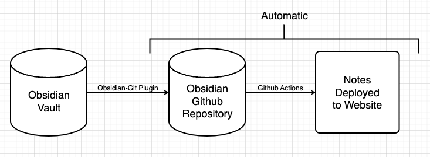
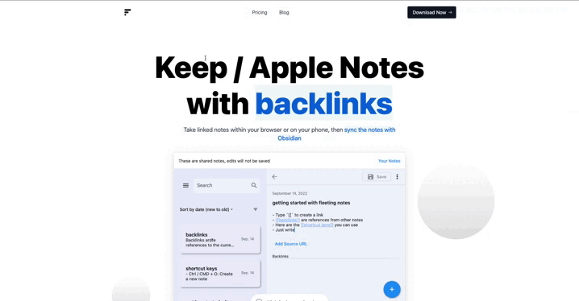

Publish your Obsidian Notes with a highly customizable Next.JS blog starter template. Features:

* Supports most Obsidian syntax (e.g. Link Previews,  Links, etc.). Uses [obsidian-export](https://github.com/zoni/obsidian-export).
* URLs are based on folder structure
* Backlinks can be added outside of the markdown files (using the [PreviewLink](https://github.com/matthewwong525/linked-blog-starter/blob/main/components/misc/preview-link.tsx) component)
* Full-text search

## [How it works](how-linked-blog-starter-works.md)

1. Notes are updated in your Obsidian Vault
1. The [Obsidian Git](https://github.com/denolehov/obsidian-git) plugin pushes the notes to the remote repository. With the following command: `Obsidian Git: Create backup`
1. A [github action](https://github.com/matthewwong525/linked-blog-starter-md/blob/main/.github/workflows/publish.yml) is automatically triggered to deploy the notes using a [specified template](https://linked-blog-starter.vercel.app/deploy-a-custom-linked-blog-starter)

## Getting Started

### [Demo](home.md)

Additionally, you can deploy the example using [Vercel](https://vercel.com/new/git/external?repository-url=https://github.com/matthewwong525/linked-blog-starter&project-name=linked-blog-starter&repository-name=linked-blog-starter) or preview live with [StackBlitz](https://stackblitz.com/github/matthewwong525/linked-blog-starter)

### [Publish your Obsidian Vault](publish-your-obsidian-notes-with-linked-blog-starter.md)

Click the link above to find out how to publish your own notes!

### [Customize this template](deploy-a-custom-linked-blog-starter.md)

Here is an example of how I [forked this repo](https://github.com/fleetingnotes/fleeting-notes-website) to create a landing page for [Fleeting Notes](https://www.fleetingnotes.app/).

